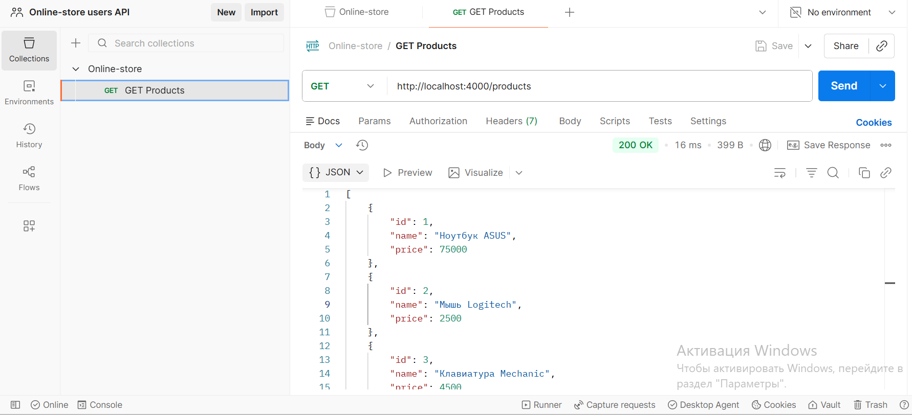
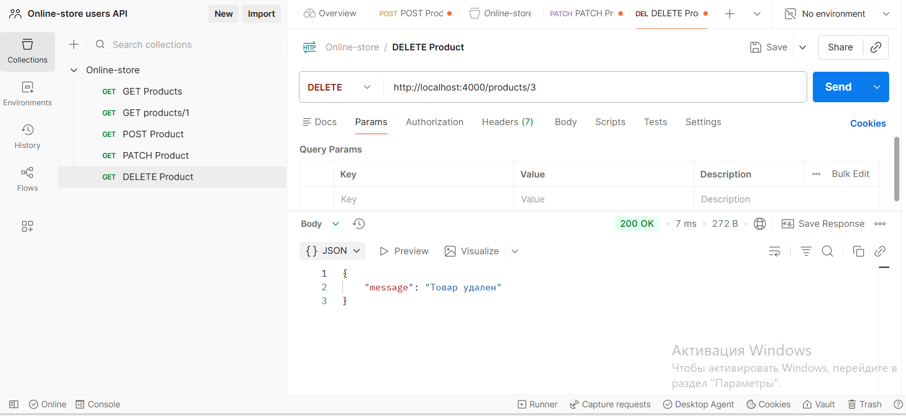
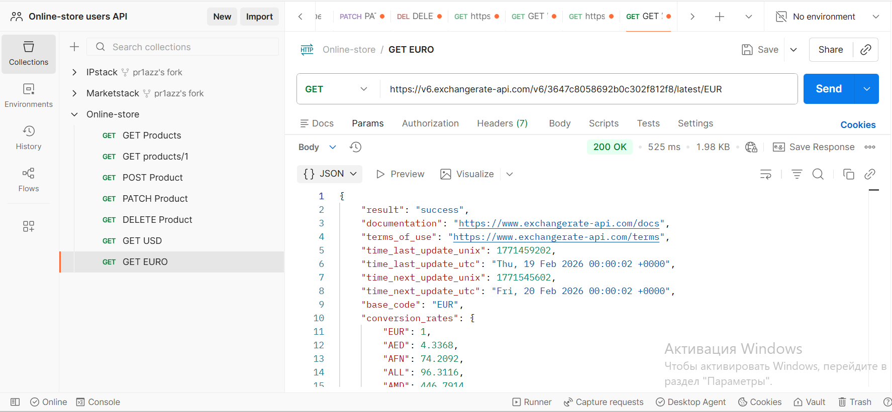
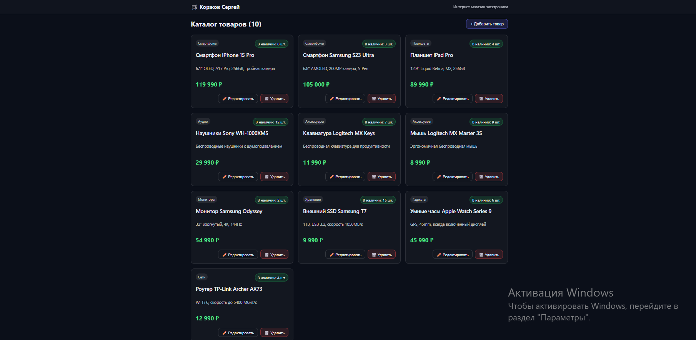
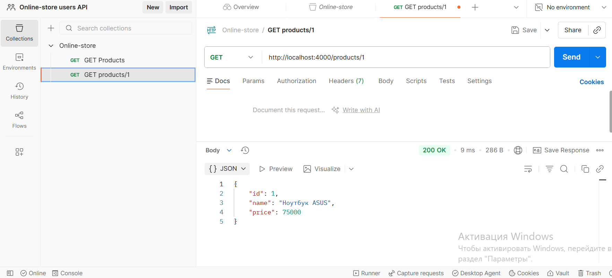
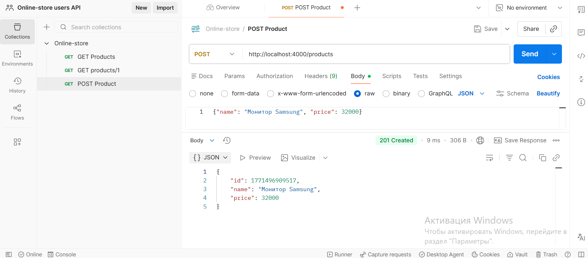
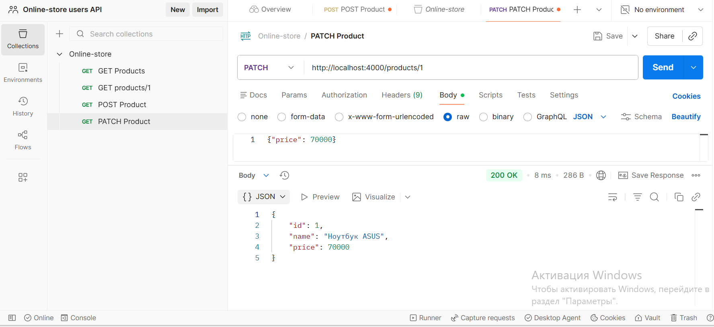
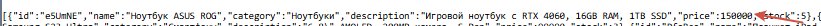
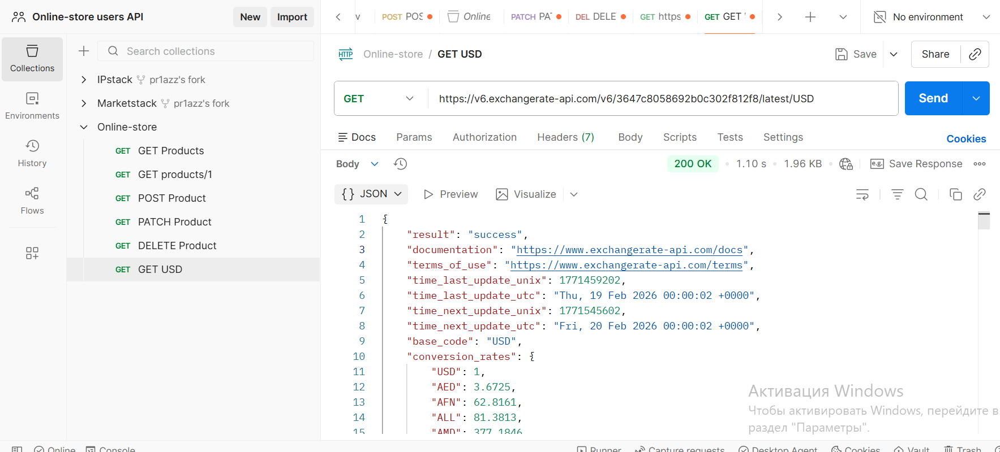

Практическое занятие №3.
1. Протестируйте ваш реалиованный API из Практического занятия 2 с помощью
Postman (не менее 3-х запросов):

2. Выберите API (пример, Открытые API) и получите ключ. Изучите документацию и
выполните не менее 5-ти запросов:
ExchangeRate-API - внешний API.
https://www.exchangerate-api.com/docs - Документация.

Практическая работа №4.

