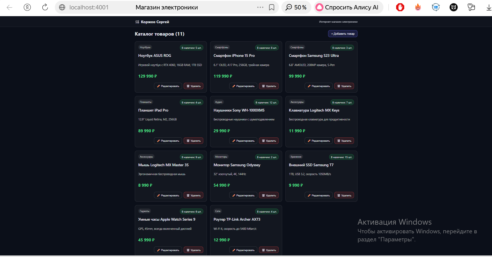
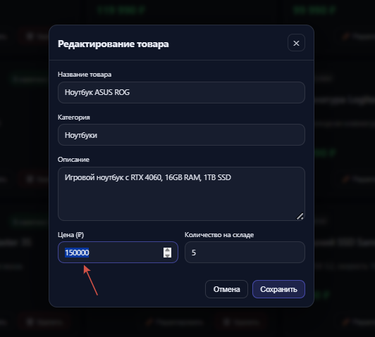
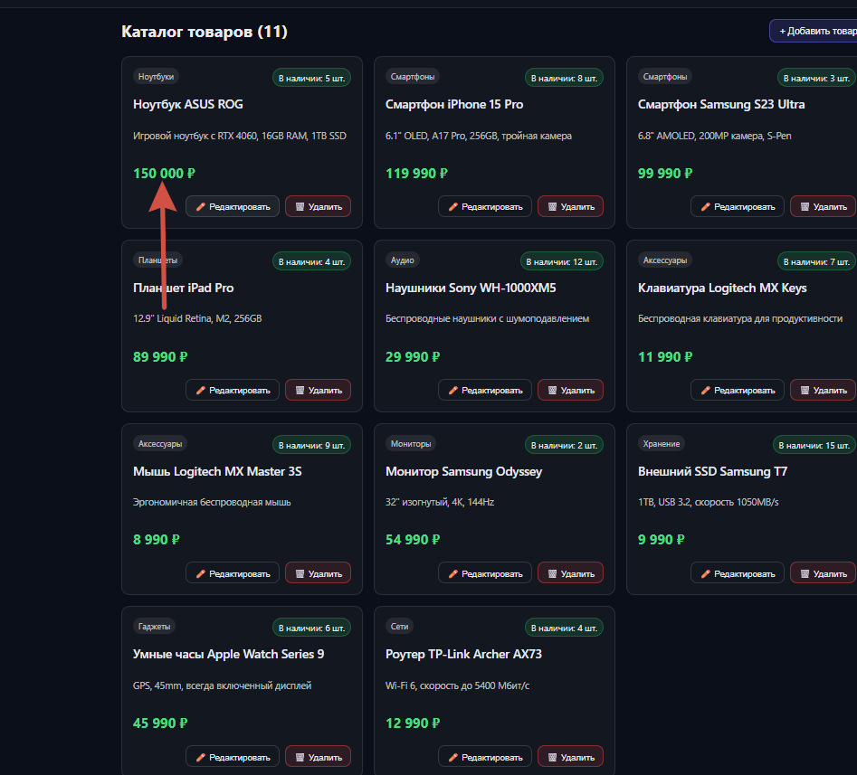
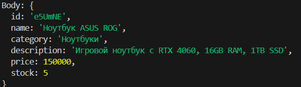
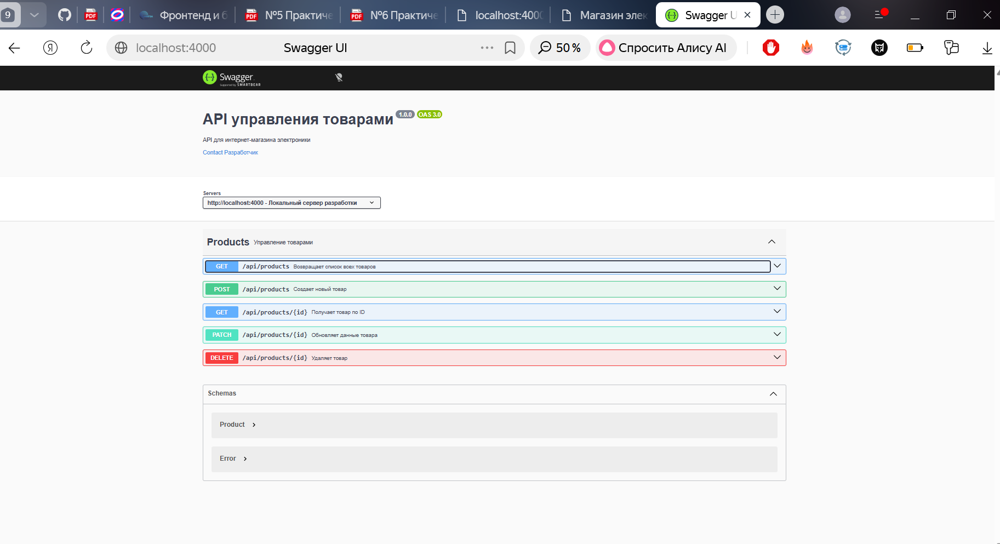
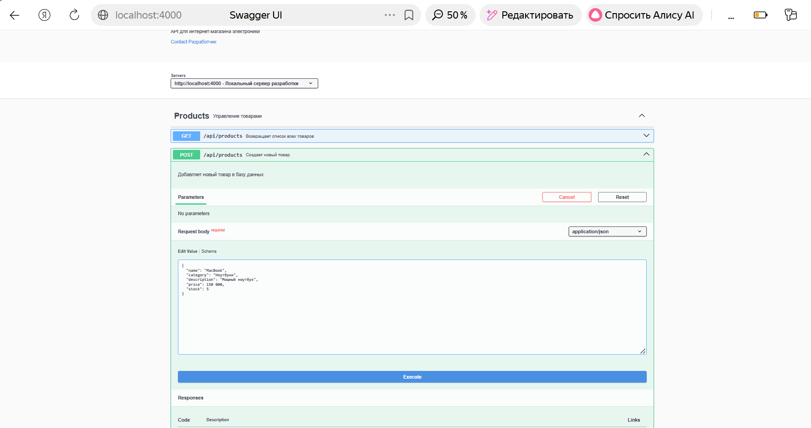

### **Практическая работа №1: CSS-препроцессоры (SASS)**
- ✅ Карточка товара с фото, названием и описанием
- ✅ Переменные (`$primary-color`, `$accent-color`, `$border-radius`)
- ✅ Миксин (`@mixin card-shadow`)
- ✅ Вложенная структура селекторов (БЭМ)

### **Практическая работа №2: Node.js + Express (CRUD API)**
- ✅ GET `/api/products` — все товары
- ✅ GET `/api/products/:id` — товар по ID
- ✅ POST `/api/products` — добавить товар
- ✅ PATCH `/api/products/:id` — редактировать товар
- ✅ DELETE `/api/products/:id` — удалить товар
- ✅ Объект товара: `id`, `name`, `price` (расширен в №4)

### **Практическая работа №3: JSON и внешние API**
- ✅ Тестирование своего API в Postman (5 запросов)
- ✅ Тестирование внешнего API (ExchangeRate-API, 5 запросов)
- ✅ Скриншоты в папке `/img`

### **Практическая работа №4: API + React (Интернет-магазин)**
- ✅ Полноценное React-приложение
- ✅ Связь с бэкендом через axios
- ✅ Интернет-магазин электроники (11 товаров)
- ✅ Карточка товара содержит: название, категорию, описание, цену, количество на складе

### **Практическая работа №5: Расширенный REST API + Swagger**
- ✅ Полная документация OpenAPI 3.0
- ✅ Интерактивный Swagger UI по адресу `/api-docs`
- ✅ Документированы все 5 CRUD эндпоинтов
- ✅ Схема `Product` с примерами

### **Практическая работа №6: Подготовка к контрольной работе**
- ✅ Проверка работоспособности
- ✅ Создание этого README.md
- ✅ Репозиторий открыт (публичный)

### **Запуск программы**
#### **Запуск бэкенда**
1. cd backend 
2. npm start
#### **Запуск фронтенда**
1. cd frontend
2. npm start

Практическое занятие №3.
1. Протестируйте ваш реалиованный API из Практического занятия 2 с помощью
Postman (не менее 3-х запросов):

2. Выберите API (пример, Открытые API) и получите ключ. Изучите документацию и
выполните не менее 5-ти запросов:
ExchangeRate-API - внешний API.
https://www.exchangerate-api.com/docs - Документация.

Практическая работа №4.
Необходимо доработать рассмотренный пример: два небольших приложение на React и
Express (для клиента и сервера, соответственно), связанных в единую систему - сайт
интернет-магазина товаров с тематикой на ваше усмотрение. Количество товаров - не
менее 10. Карточка товара должна содержать как минимум: название, категорию,
описание товара, цену, количество на складе.

